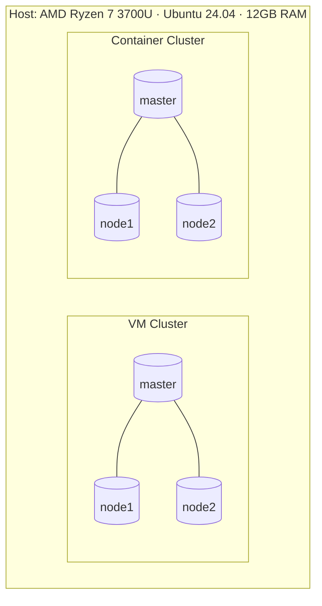

# VM & Container Mini-Cluster: Setup, Benchmarks, and Takeaways

> _This readme follows the exact order and tone from the original notes. It’s meant to be readable, a bit informal, and not too “polished.”_

## Intro
In this report we walk through what we did to spin up two tiny clusters — one with VirtualBox VMs and one with Docker containers — and we drop the performance numbers we measured. Both clusters have one **master** and two **workers**. Here’s the rough shape of both setups:


Host specs (to keep context): **CPU:** AMD Ryzen 7 3700U · **OS:** Ubuntu 24.04 · **RAM:** 12GB. fileciteturn1file0

---

## Steps — VM Cluster (VirtualBox)
We used VirtualBox plus the **Ubuntu 24.04 live server ISO** (`ubuntu-24.04-live-server-amd64.iso`). The ISO can be found on Ubuntu old releases if you need the exact image. We created **3 nodes** and gave each: **2 vCPUs, 2GB RAM, 25GB disk**. fileciteturn1file0

1) **Create a template VM** in VirtualBox
- Name it `template`, pick the downloaded Ubuntu ISO.
- **Uncheck** “Proceed with Unattended Installation”.
- Set resources: 2 CPU, 2GB RAM, 25GB disk.
- Boot, install Ubuntu, then run:
  ```bash
  sudo apt update && sudo apt upgrade -y
  sudo apt install -y gcc make net-tools openssh-server
  ```
- Power off the template. fileciteturn1file5

2) **Clone 3 times** → `master`, `node1`, `node2`. fileciteturn1file5

3) **VirtualBox network**
- Create an internal network: **File → Tools → Network → Create** → name becomes `vboxnet0`. Enable **DHCP**. fileciteturn1file5
- **Master VM**: in **Settings → Network**:
  - Adapter 2 → **Enable** → **Internal Network** → `vboxnet0`.
  - Adapter 1 → keep **NAT**, and add a **Port Forwarding** rule (for SSH from host). The original had a picture; here it is as a table:
  
  | Name | Protocol | Host Port | Guest Port |
  |------|----------|-----------|------------|
  | ssh  | TCP      | **2121**  | **22**     |
  
  (We used `2121` during key copy from host → master.) fileciteturn1file5

- **Workers** (`node1`, `node2`): **Adapter 1 → Internal Network** `vboxnet0` (instead of NAT). Save. fileciteturn1file5

4) **Basic node identity & hosts**
- On each VM:
  ```bash
  sudo vim /etc/hostname   # change from template → actual name
  sudo vim /etc/hosts      # add lines: <node_ip> <node_name> for every node
  ```
  fileciteturn1file5

5) **Passwordless SSH**
- Generate keys (host and on master) and copy:
  ```bash
  ssh-keygen -t rsa
  ssh-copy-id -p 2121 <user>@127.0.0.1      # host → master via NAT forward 2121
  ssh-copy-id <user>@<worker_node_ip>       # master → workers
  ```
  Now you can hop around without passwords. fileciteturn1file7

6) **Netplan (internal LAN)**
- Edit `/etc/netplan/50-cloud-init.yaml` on nodes. Example (master shown):
  ```yaml
  network:
    ethernets:
      enp0s3:
        dhcp4: true
      enp0s8:
        dhcp4: false
        addresses: [192.168.0.1/24]
    version: 2
  ```
  Apply changes with `sudo netplan apply`. fileciteturn1file7

7) **NFS share** (so all nodes see `/shared`)
- On master:
  ```bash
  sudo apt install -y nfs-kernel-server
  sudo mkdir -p /shared
  echo "/shared 192.168.0.0/24(rw,sync,no_subtree_check)" | sudo tee -a /etc/exports
  sudo exportfs -a
  sudo systemctl restart nfs-kernel-server && sudo systemctl enable nfs-kernel-server
  ```
- On workers:
  ```bash
  sudo apt install -y nfs-common
  sudo mkdir -p /shared
  sudo mount <master_ip>:/shared /shared
  # make it persistent:
  echo "192.168.0.1:/shared /shared nfs defaults 0 0" | sudo tee -a /etc/fstab
  sudo mount -a
  ```
  Test from master: `touch /shared/test.txt` and verify on workers. fileciteturn1file7

---

## Steps — Container Cluster (Docker + Compose)
We built an image with the same tooling we needed for tests (OpenMPI/MPICH, hpcc, sysbench, stress‑ng, iperf3, iozone, SSH) and created **master**, **node1**, **node2** containers with the same resource limits (2 CPU, 2GB RAM). SSH keys are wired in and a shared volume is mounted at `/shared`. fileciteturn1file11

**Dockerfile (summary):**
- Base: `ubuntu:latest`
- Installs: `openssh-server`, `hpcc`, `mpich`, `openmpi-*`, `sysbench`, `stress-ng`, `iperf3`, `iozone3`, etc.
- Creates user `user` with passwordless sudo, enables pubkey auth, exposes `22`, and starts `sshd`. fileciteturn1file11

**docker-compose.yaml (summary):**
- Services: `master`, `node1`, `node2`
- Limits: `cpus: "2"`, `memory: 2G`
- Ports: `2220:22`, `2221:22`, `2222:22`
- Shared volume: `shared_volume:/shared`
- Bridge network: `my_network`  
Start them with:
```bash
sudo docker compose up -d
# SSH into nodes from host:
ssh -p 2220 user@localhost   # master
ssh -p 2221 user@localhost   # node1
ssh -p 2222 user@localhost   # node2
```
fileciteturn1file6

---

## Test Results (VMs vs Containers)

> We collected HPCC (HPL, STREAM, FFT, RandomAccess, latency/bandwidth), stress‑ng, sysbench, and network throughput (iperf3). Where it helps, we summarize in small tables and add a one‑liner “what it means.”

### HPCC — Highlights
**HPL (Linpack)**
| Cluster | N | NB | P×Q | Time (s) | Gflops |
|---|---:|---:|:--:|---:|---:|
| VMs | 10176 | 192 | 2×2 | **256.96** | **2.734** |
| Containers | 10176 | 192 | 2×2 | 302.28 | 2.324 |

_HPL solves a big dense linear system; higher Gflops is better. Here, the VM run actually edged out the container run on this box/config._ fileciteturn1file14 fileciteturn1file16

**STREAM (memory bandwidth, “StarSTREAM” aggregate)**  
GB/s (higher is better):

| Cluster | Copy | Scale | Add | Triad |
|---|---:|---:|---:|---:|
| VMs | **4.586** | **2.901** | **3.636** | **3.477** |
| Containers | 4.313 | 1.593 | 2.017 | 2.120 |

_VM aggregate STREAM looks a bit higher, while **SingleSTREAM** max per‑node favors containers (likely less overhead in a single process inside a container): VMs SingleSTREAM Copy 13.34 vs Containers 19.62._ fileciteturn1file0 fileciteturn1file3

**FFT & RandomAccess (selected)**
- **MPIFFT Gflop/s:** VMs 0.598 vs Containers **1.615** (containers faster here). fileciteturn1file0 fileciteturn1file3
- **MPIRandomAccess GUP/s:** VMs 0.001386 vs Containers **0.011126** (containers much faster on this run). fileciteturn1file14 fileciteturn1file12

**Latency/Bandwidth (HLRS benchmark)**
| Cluster | Ping‑Pong Max Latency (ms) | Min PP Bandwidth (MB/s) | Ring Bandwidth (Natural, MB/s) |
|---|---:|---:|---:|
| VMs | 0.194 | 125.998 | 73.609 |
| Containers | **0.000365** | **4612.972** | **1747.077** |

_Containers crush VMs for intra‑cluster comms latency and bandwidth (expected, fewer virtualization layers and a faster virtual network path)._ fileciteturn1file0 fileciteturn1file17

### Network Throughput (iperf3)
10‑second runs (higher is better):

**VMs**
| Direction | Transfer | Bitrate | Retrans |
|---|---:|---:|---:|
| worker → master | 15.4 GB | **13.2 Gbit/s** | 0 |
| master → worker | 13.9 GB | **12.0 Gbit/s** | 0 |
| worker ↔ worker (upload) | 1.86 GB | **1.60 Gbit/s** | 3030 |
| worker ↔ worker (download) | 1.57 GB | **1.34 Gbit/s** | 2496 |

**Containers**
| Direction | Transfer | Bitrate | Retrans |
|---|---:|---:|---:|
| worker → master | 15.8 GB | **13.5 Gbit/s** | 0 |
| master → worker | 15.3 GB | **13.1 Gbit/s** | 0 |
| worker ↔ worker (upload) | 15.7 GB | **13.4 Gbit/s** | 0 |
| worker ↔ worker (download) | 15.2 GB | **13.1 Gbit/s** | 0 |

_Container networking was consistently faster and cleaner (zero retrans) vs the VM worker↔worker case which showed much lower throughput and lots of retransmits._ fileciteturn1file13 fileciteturn1file8

### stress‑ng (60s)
We condense to the main “rate” columns.

**VMs**
| Stressor | bogo ops | real (s) | usr+sys (s) | bogo ops/s (real) |
|---|---:|---:|---:|---:|
| CPU | 45,289 | 59.60 | 60.31 | **759.83** |
| Memory (vm) | 570,557 | 60.39 | 48.0 | **9448.32** |
| Disk I/O | 9,066 | 60.01 | 4.01 | **151.07** |

**Containers**
| Stressor | bogo ops | real (s) | usr+sys (s) | bogo ops/s (real) |
|---|---:|---:|---:|---:|
| CPU | 51,197 | 60.06 | 60.01 | **852.45** |
| Memory (vm) | 18,432 | 60.43 | 32.87 | **305.02** |
| Disk I/O | 86,507 | 60.01 | 13.36 | **1441.66** |

_CPU and especially Disk I/O preferred containers here; VM memory “vm” stressor score was much higher (method/limits differ, so take the memory row with a grain of salt)._ fileciteturn1file10

### sysbench (averages)
We just take simple averages as requested.

**VMs**
- **CPU (events/s):** (488.88, 489.92, 494.24, 482.23) → **≈ 488.82**  
- **Memory (MiB/s):** (6859.65, 7046.03, 7204.15, 7973.81) → **≈ 7270.91** fileciteturn1file2

**Containers**
- **CPU (events/s):** (604.38, 606.65, 611.43, 612.61) → **≈ 608.77**  
- **Memory (MiB/s):** (8186.25, 8780.14, 9910.28, 10039.09) → **≈ 9228.94** fileciteturn1file4

### Disk I/O (iozone 3D plots)
We generated a full set of 13 plots per cluster (write/read variants, stride/random, etc.). Saved paths:

- **VM plots:** `/iozone_plots_vm/*.png`  
- **Container plots:** `/iozone_plots_c/*.png`

(We’re not embedding them to keep the README compact.) fileciteturn1file4

---

## Observations (quick + honest)
- **Network inside containers** is way snappier (latency/bandwidth) and that spilled over into some HPCC kernels as well.
- **HPL** was actually better on the **VM** run here (2.73 vs 2.32 Gflops). Could be scheduling, NUMA placement, or the container MPI stack build on this host.
- **Sysbench** tilted toward **containers** for both CPU and memory averages.
- **Disk I/O** with stress‑ng looked far better in containers; VM path likely bottlenecked by the virtual disk stack.

---

## Conclusion (short)
If you just want quick parallel tests, containers feel **lighter and faster** overall (comms and I/O especially). For dense linear algebra (HPL) on this exact hardware and config, the **VM run held its own** and even topped the container run. Real takeaway: it pays to test both if you care about a specific workload.
