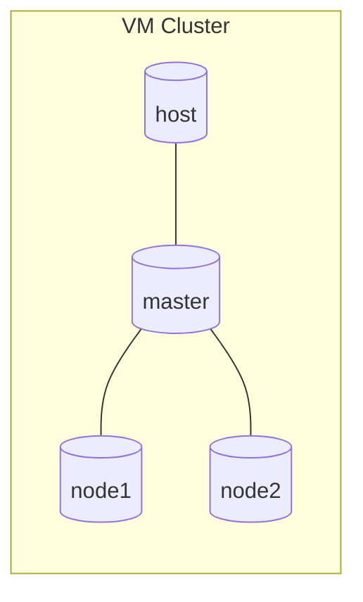
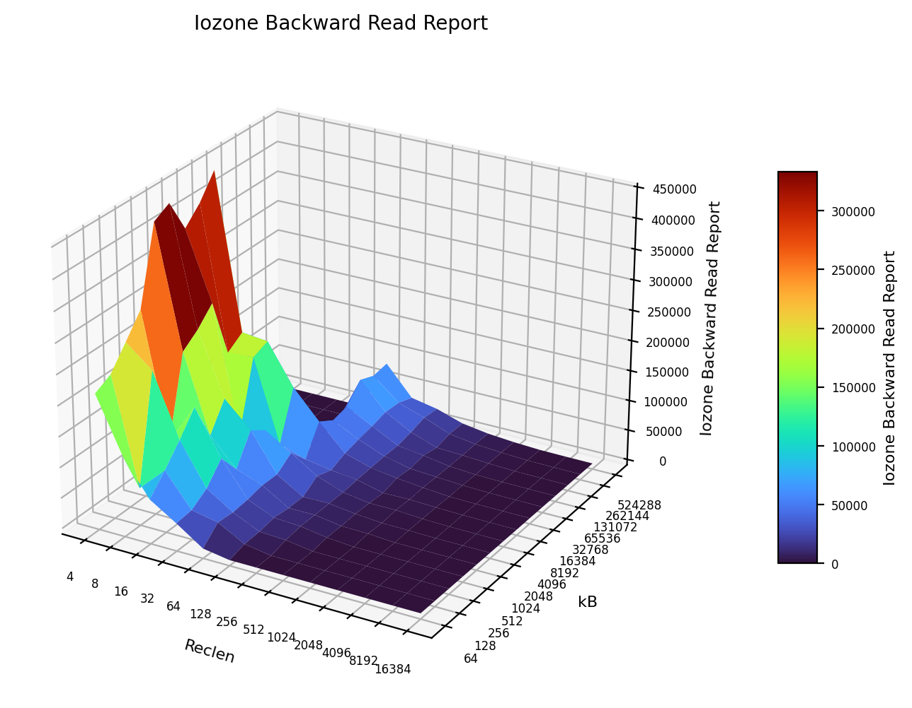
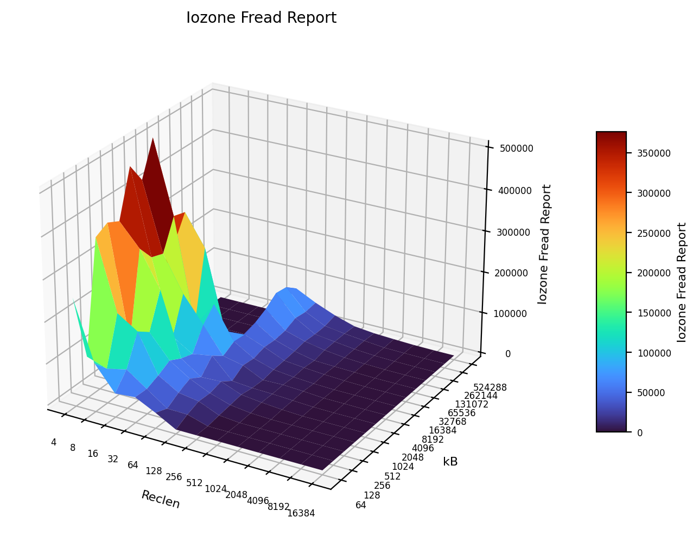
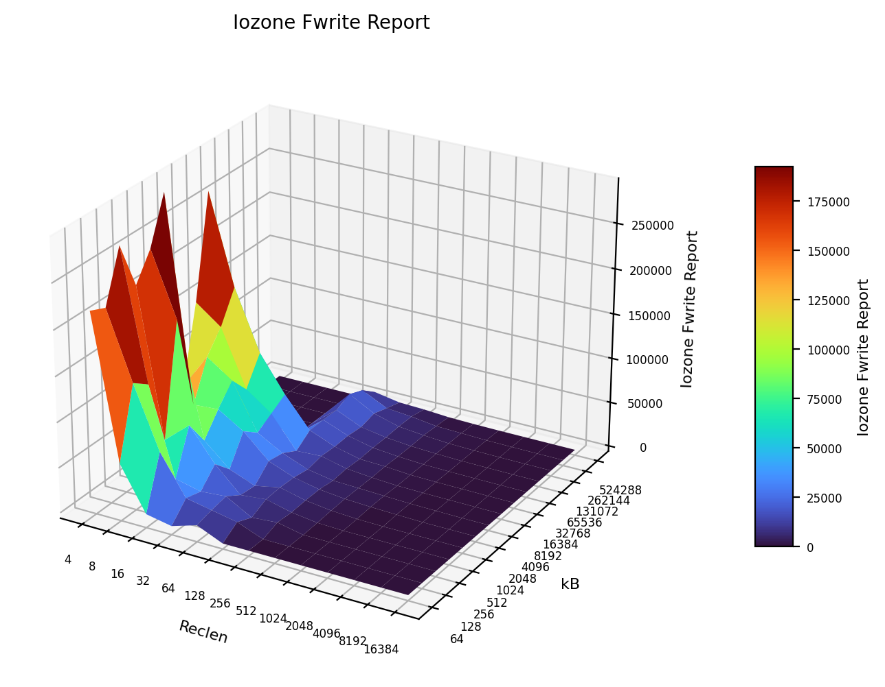
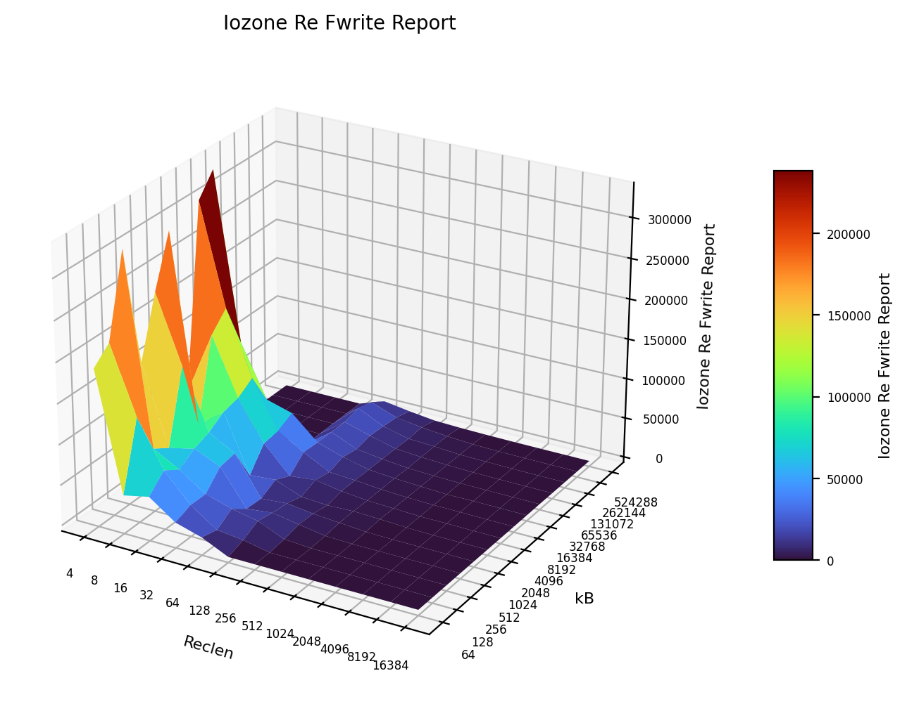
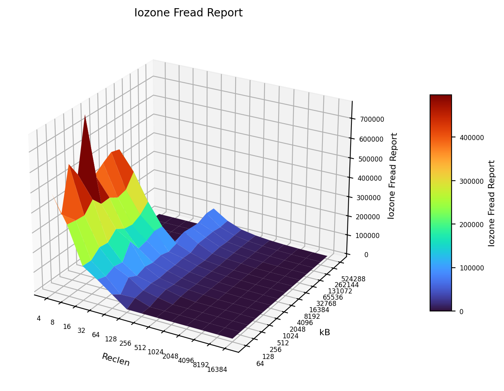
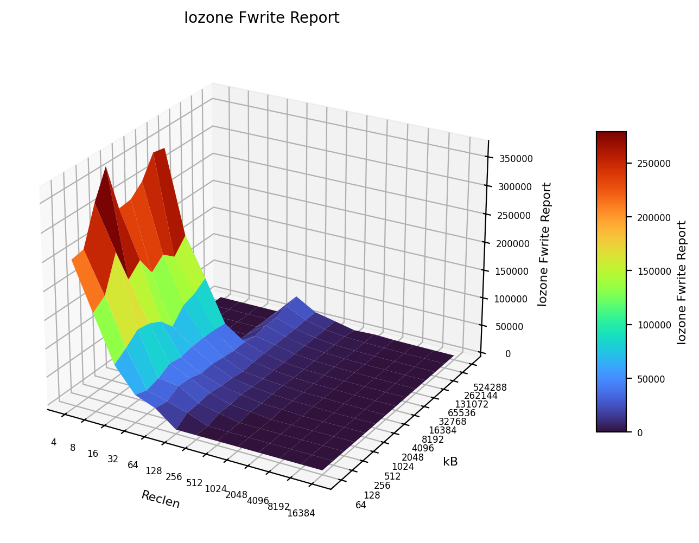

# Assignment report

## Intro
In this report we walk about how we can set up a small cluaster with either VMs or Docker Container,and in the end we descuss and compare how they did on the performance tests. Both clusters have one **master** and two **worker** nodes. This is their setup:


Host specs: **CPU:** AMD Ryzen 7 3700U · **OS:** Ubuntu 24.04 · **RAM:** 12GB.

---

## Steps — VM Cluster (VirtualBox)
VirtualBox was used plus the **Ubuntu 24.04 live server ISO**. The ISO can be found on [Ubuntu old releases](https://old-releases.ubuntu.com/releases/24.04/) (look for `ubuntu-24.04-live-server-amd64.iso`). The created cluster consisted of **3 nodes** and each had the following resources: **2 vCPUs, 2GB RAM, 25GB disk**.

1) **Create a template VM** in VirtualBox
- Name it `template`, pick the downloaded Ubuntu ISO.
- **Uncheck** “Proceed with Unattended Installation”.
- Set resources: 2 CPU, 2GB RAM, 25GB disk.
- Boot, install Ubuntu, then run:
  ```bash
  sudo apt update && sudo apt upgrade -y
  sudo apt install -y gcc make net-tools openssh-server
  ```
- Shut down the template node.

2) **Clone the template node 3 times and name them** → `master`, `node1`, `node2`. 

3) **VirtualBox network**
- Create an internal network: **File → Tools → Network → Create** → name is automatcly set to `vboxnet0`. Enable **DHCP** and save changes. 
- On the **Master Node**: in **Settings** select **Network**:
  - Adapter 2 → **Enable** → **Internal Network** → name is automaticly set to `vboxnet0`.
  - Adapter 1 → Add the following **Port Forwarding** rule:
  
  | Name | Protocol | Host Port | Guest IP   | Guest Port |
  |------|----------|-----------|------------|------------|
  | ssh  | TCP      | **2121**  |            | **22**     |
  

- For **Workers** (`node1`, `node2`): just like with master node, select **Settings**, then **Network**, and then  on **Adapter 1** change the **Attached to** setting to **Internal Network** and name will automatibly be set to `vboxnet0` (instead of NAT). Save. 

4) **Basic node identity & hosts**
- For each node do the following commands (#and do the change as commented):
  ```bash
  sudo vim /etc/hostname   # change from template → actual name
  sudo vim /etc/hosts      # add lines: <node_ip> <node_name> for every node
  ```
  

5) **SSH setup**
- In order to avoid having to type a passoword every time every time we connect from host to the master node or from a master node to a worker node, we can set up the ssh in the following way:
  ```bash
  ssh-keygen -t rsa
  ssh-copy-id -p 2121 <user>@127.0.0.1      # host → master via NAT forward 2121
  ssh-copy-id <user>@<worker_node_ip>       # master → workers
  ```

6) **Network configuration**

- In order to configure thr network we have to check its settings first.
```bash
  ip link show

1: lo: <LOOPBACK,UP,LOWER_UP> mtu 65536 qdisc noqueue state UNKNOWN mode
DEFAULT group default qlen 1000
link/loopback 00:00:00:00:00:00 brd 00:00:00:00:00:00
2: enp0s3: <BROADCAST,MULTICAST,UP,LOWER_UP> mtu 1500 qdisc fq_codel
state UP mode DEFAULT group default qlen 1000
link/ether 08:00:27:61:85:06 brd ff:ff:ff:ff:ff:ff
3: enp0s8: <BROADCAST,MULTICAST> mtu 1500 qdisc noop state DOWN mode
DEFAULT group default qlen 1000
link/ether 08:00:27:fb:88:3a brd ff:ff:ff:ff:ff:ff
  ```

- Edit `/etc/netplan/50-cloud-init.yaml` so it looks like this:
  ```yaml
  network:
    ethernets:
      enp0s3:
        dhcp4: true
      enp0s8:
        dhcp4: false
        addresses: [192.168.0.1/24]
    version: 2
  ```
  Apply changes with `sudo netplan apply`. 

7) **Distribute Filesystem**
- The next step was to set up the distributed file system. It was done the following way:
- On master:
  ```bash
  sudo apt install -y nfs-kernel-server
  sudo mkdir -p /shared
  echo "/shared 192.168.0.0/24(rw,sync,no_subtree_check)" | sudo tee -a /etc/exports
  sudo exportfs -a
  sudo systemctl restart nfs-kernel-server && sudo systemctl enable nfs-kernel-server
  ```
- On workers:
  ```bash
  sudo apt install -y nfs-common
  sudo mkdir -p /shared
  sudo mount <master_ip>:/shared /shared
  # make it persistent:
  echo "192.168.0.1:/shared /shared nfs defaults 0 0" | sudo tee -a /etc/fstab
  sudo mount -a
  ```
  Test from master: `touch /shared/test.txt` and verify on workers. 

---

## Container Cluster
We built an image with the same tooling we needed for tests (OpenMPI/MPICH, hpcc, sysbench, stress‑ng, iperf3, iozone, SSH) and created **master**, **node1**, **node2** containers with the same resource limits (2 CPU, 2GB RAM). SSH keys are wired in and a shared volume is mounted at `/shared`. 

**Dockerfile (summary, see the repo files for exact details):**
- Base: `ubuntu:latest`
- Installs: `openssh-server`, `hpcc`, `mpich`, `openmpi-*`, `sysbench`, `stress-ng`, `iperf3`, `iozone3`, etc.
- Creates user `user` with passwordless sudo, enables pubkey auth, exposes `22`, and starts `sshd`.

**docker-compose.yaml (summary, same as with the dockerfile):**
- Services: `master`, `node1`, `node2`
- Limits: `cpus: "2"`, `memory: 2G`
- Ports: `2220:22` - `master`, `2221:22` - `node1`, `2222:22` - `node2`

But before we start the containers we need to generate the SSH keys in our project folder with:
```bash
mkdir -p ssh_keys
ssh-keygen -t rsa -b 4096 -f ssh_keys/id_rsa -N ""
```
Starting containers is done with:
```bash
sudo docker compose up -d
```
Each of the containers can be acceses from the host machine by typing one of the following lines:
 
```bash
ssh -i ssh_keys/id_rsa -p 2220 user@localhost   # master
ssh -i ssh_keys/id_rsa -p 2221 user@localhost   # node1
ssh -i ssh_keys/id_rsa -p 2222 user@localhost   # node2
```
And you can also access the worker nods from master node by typing `ssh user@<worker_IP>`

---

## Test Results (VMs vs Containers)

### HPCC
**HPL (Linpack)**
| Cluster | N | NB | P×Q | Time (s) | Gflops |
|---|---:|---:|:--:|---:|---:|
| VMs | 10176 | 192 | 2×2 | **256.96** | **2.734** |
| Containers | 10176 | 192 | 2×2 | 302.28 | 2.324 |

_HPL solves a big dense linear system; higher Gflops is better. Here, the VM run actually edged out the container run on this box/config._

**STREAM (memory bandwidth, “StarSTREAM” aggregate)**  
GB/s (higher is better):

| Cluster | Copy | Scale | Add | Triad |
|---|---:|---:|---:|---:|
| VMs | **4.586** | **2.901** | **3.636** | **3.477** |
| Containers | 4.313 | 1.593 | 2.017 | 2.120 |

_VM aggregate STREAM looks a bit higher, while **SingleSTREAM** max per‑node favors containers (likely less overhead in a single process inside a container): VMs SingleSTREAM Copy 13.34 vs Containers 19.62._ 

**FFT & RandomAccess**
- **MPIFFT Gflop/s:** VMs 0.598 vs Containers **1.615** (containers faster here). 
- **MPIRandomAccess GUP/s:** VMs 0.001386 vs Containers **0.011126** (containers much faster on this run). 

**Latency/Bandwidth (HLRS benchmark)**
| Cluster | Ping‑Pong Max Latency (ms) | Min PP Bandwidth (MB/s) | Ring Bandwidth (Natural, MB/s) |
|---|---:|---:|---:|
| VMs | 0.194 | 125.998 | 73.609 |
| Containers | **0.000365** | **4612.972** | **1747.077** |

_Containers crush VMs for intra‑cluster comms latency and bandwidth (expected, fewer virtualization layers and a faster virtual network path)._ 

### Network Tests (iperf3)

**VMs**
| Direction | Transfer | Bitrate | Retrans |
|---|---:|---:|---:|
| worker → master | 15.4 GB | **13.2 Gbit/s** | 0 |
| master → worker | 13.9 GB | **12.0 Gbit/s** | 0 |
| worker ↔ worker (upload) | 1.86 GB | **1.60 Gbit/s** | 3030 |
| worker ↔ worker (download) | 1.57 GB | **1.34 Gbit/s** | 2496 |

**Containers**
| Direction | Transfer | Bitrate | Retrans |
|---|---:|---:|---:|
| worker → master | 15.8 GB | **13.5 Gbit/s** | 0 |
| master → worker | 15.3 GB | **13.1 Gbit/s** | 0 |
| worker ↔ worker (upload) | 15.7 GB | **13.4 Gbit/s** | 0 |
| worker ↔ worker (download) | 15.2 GB | **13.1 Gbit/s** | 0 |

_Container networking was consistently faster and cleaner (zero retrans) vs the VM worker↔worker case which showed much lower throughput and lots of retransmits._ 

### stress‑ng 

**VMs**
| Stressor | bogo ops | real (s) | usr+sys (s) | bogo ops/s (real) |
|---|---:|---:|---:|---:|
| CPU | 45,289 | 59.60 | 60.31 | **759.83** |
| Memory (vm) | 570,557 | 60.39 | 48.0 | **9448.32** |
| Disk I/O | 9,066 | 60.01 | 4.01 | **151.07** |

**Containers**
| Stressor | bogo ops | real (s) | usr+sys (s) | bogo ops/s (real) |
|---|---:|---:|---:|---:|
| CPU | 51,197 | 60.06 | 60.01 | **852.45** |
| Memory (vm) | 18,432 | 60.43 | 32.87 | **305.02** |
| Disk I/O | 86,507 | 60.01 | 13.36 | **1441.66** |

_CPU and especially Disk I/O preferred containers here; VM memory “vm” stressor score was much higher (method/limits differ, so take the memory row with a grain of salt)._

### sysbench

**VMs**
- **CPU (events/s):** (488.88, 489.92, 494.24, 482.23) → **≈ 488.82**  
- **Memory (MiB/s):** (6859.65, 7046.03, 7204.15, 7973.81) → **≈ 7270.91** 

**Containers**
- **CPU (events/s):** (604.38, 606.65, 611.43, 612.61) → **≈ 608.77**  
- **Memory (MiB/s):** (8186.25, 8780.14, 9910.28, 10039.09) → **≈ 9228.94** 

### Disk I/O 

**VMs:**









  

**Containers:**






---

## Observations
- **Network inside containers** is way snappier (latency/bandwidth) and that spilled over into some HPCC kernels as well.
- **HPL** was actually better on the **VM** run here (2.73 vs 2.32 Gflops). Could be scheduling, NUMA placement, or the container MPI stack build on this host.
- **Sysbench** tilted toward **containers** for both CPU and memory averages.
- **Disk I/O** with stress‑ng looked far better in containers; VM path likely bottlenecked by the virtual disk stack.

---

## Conclusion
If you just want quick parallel tests, containers feel **lighter and faster** overall (comms and I/O especially). For dense linear algebra (HPL) on this exact hardware and config, the **VM run held its own** and even topped the container run. Real takeaway: it pays to test both if you care about a specific workload.
